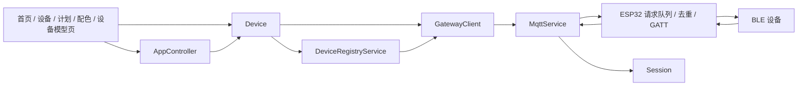

# 设备管理与命令下发实现分析

分析范围：Flutter 应用 `light/`，以及同仓库 `esp/components/gateway_core` 和
`esp/components/device_manager` 的协议、调度与登记实现。核查日期：2026-09-20。
结论以源码及假 MQTT 测试为依据，未连接真实 BLE 硬件验证。

本文描述本轮改造后的工作区：设备控制只剩「设备模型 + 设备模型会话」一条链路，
控制器不再保存任何灯光面板状态，场景、计划、输出上限都以属性值表达。

## 1. 当前结构与保留的可靠性基础



应用已有清楚的传输边界：`MqttService` 处理 MQTT，`GatewayClient` 负责 reqId 关联与状态快照，
`Device` 处理业务字节协议。网关只做 BLE 原语，App 负责物模型与设备编解码，
固件里不写任何设备私有报文。

已有可靠性基础值得保留：

- App 下行 MQTT QoS 1 且不 retain，避免网关重连执行历史指令
- `GatewayClient` 对 reqId 去重，对快照 revision 断档重新同步，断线使待确认请求失败
- ESP 的 `accept_message` 以 clientId+reqId 检查进行中请求及结果缓存，已有重投去重
- ESP 调度器按同设备请求序号串行，限制全局 GATT 并发，并在超时后隔离/断开异常连接
- 登记管理已有自动重连和退避机制，但设备被 V1 协议接管后该管理器停止自动连接和订阅，
  App 会话需要显式 connect/subscribe；设备模型会话在首次下发前完成这两步

MQTT QoS 1、网关请求去重和「恰好执行一次」是不同层次。网关缓存有容量限制、重启会丢失；
生成新 reqId 的重试也会成为新操作。重启、校准等非幂等服务不能由 App 无条件重发。

## 2. 本轮落地的四步改造

### 第一步：场景与计划改存属性值

`ScenePreset` 与 `SchedulePlan` 都不再持有设备私有结构（原来的 `LightState`、
`powerEnabled`、`temperature`、`fanSpeed`、输出上限），改为保存属性值：

```dart
class ScenePreset {
  final Map<String, Object?> properties; // 键是设备模型里的属性标识
}

class SchedulePlan {
  static const String timerProperty = 'timer';
  final Map<String, Object?> properties; // 定时槽位的属性值
}
```

- 配色保存 `{'power': true, 'channels': {...}}` 这类属性值，卡片的通道摘要与平均亮度
  都从属性值推导，不再有独立的亮度、色温字段
- 计划保存 `{'timer': {'index': …, 'enabled': …, 'startHour': …}}`，开关状态与时间标签
  都是这份属性值的视图，`SchedulePlan.copyWith` 只更新属性值里的对应字段
- 旧数据、旧配色导出和旧版备份里的 `state`、平铺定时字段在读入时自动转换成属性值，
  因此本机升级与旧 JSON 导入都不需要人工改文件
- 配色控件按当前设备模型的颜色属性生成：属性名、通道名、上下限都来自模型定义，
  换一台设备不需要改配色代码

### 第二步：四个入口一律走 Device

`AppController` 里原本直接改写面板状态或走旧 AT5 会话的入口全部改成属性写入：

| 入口 | 现在的行为 |
| --- | --- |
| `applyScene` | 取配色里当前模型声明且可写的属性，`writeProperties` 一次批量下发 |
| `toggleSchedule` | 先保存本机计划，再写 `time` 属性对时并写 `timer` 属性更新槽位 |
| `setOutputLimit` | 模型声明可写的 `outputLimit` 时写该属性，否则把当前数值属性按上限收敛后写回 |
| `selectDevice` | 选中设备即绑定它的设备模型会话，键为 `(gatewayId, deviceId)` |

由此带来的具体行为变化：

- 定时槽位数量不再写死在控制器里，超出模型 `timer.index` 约束的计划由模型校验拒绝，
  只保存在本机并给出提示
- 输出上限不再是本机持久状态。设备没有上限属性时，上限通过「收敛后的属性值」落到设备，
  界面显示一律以设备回报为准，不再用本机设置冒充硬件状态
- 选中的设备与其模型会话一一对应，切换设备不再释放上一台设备的会话，多设备状态可以并存

### 第三步：删除遗留文件与控制器面板状态

删除的文件：

| 文件 | 原职责 |
| --- | --- |
| `lib/src/core/device/device.dart` | `Device` / `DeviceFunction` 卡片框架 |
| `lib/src/core/device/impl/model_device.dart` | 用功能卡片承载设备模型的适配器 |
| `lib/src/core/device/checksum.dart` | 旧 AT5 校验实现，模型里已有等价定义 |
| `lib/src/core/remote/device_session.dart` | 旧 `DeviceRemoteSession` |
| `lib/src/core/functions/*` | 电源、灯光、温控、风扇、定时功能与控件 |
| `lib/src/util/check.dart` | 只服务于已删除的 `BleServiceDesc` 解析 |
| `lib/src/widgets/device_card.dart` | 只被已删除的功能控件使用 |
| `lib/src/dialog/device.dart` | 未再被任何页面调用的设备编辑对话框 |

`AppController` 同步删除了面板状态与旧链路：`lightState`、`powerEnabled`、`temperature`、
`fanSpeed`、`outputLimit`、`applying`、`commandStatus`、`controlBindings`、`deviceCardFor`、
`_at5Session(s)`、`_runDeviceAction` 及其负载拼装。界面判断忙碌改用
`devicesBusy`（任一设备会话有排队命令）。

`core/protocol/remote_protocol.dart` 收缩为通道层面的 `ConnectionStatus` 与 `RemoteSnapshot`，
`DeviceCommand`、`RemoteConfirmation`、`RemoteWriteStep`、`RemoteDeviceCodec`、
`RemoteDeviceSession` 等旧设备协议类型一并移除。

对话框与数据库同样清理：

- `dialog/scene.dart` 按设备模型渲染颜色通道滑杆，保存属性值
- `dialog/schedule.dart` 生成/更新 `timer` 属性值，编辑已有计划时保留日出日落字段
- 数据库删除 `app_settings` 与 `device_settings` 两张设置表，schema 版本升到 5
  （写入 SQLite `user_version`）。旧库升级时直接删表，不再迁移本机控制设置
- 备份格式升到 `schemaVersion: 4`，不再包含 `settings` / `deviceSettings`，
  导入 `schemaVersion: 3` 的旧备份仍然可用（配色与计划按属性值转换）
- 旧网关归属迁移不再依赖一次性标记：连接成功后把 `gateway_id = ''` 的历史行归到当前网关，
  该操作天然幂等
- 内置配色与默认计划只在全新数据库（或「恢复默认数据」）写入一次：原来用 `app_settings`
  标记的「只更新未修改的默认配色」迁移随设置表一起取消，已有数据不再被自动改写

### 第四步：文档与全量验证

- 本文按改造后的实现重写，模块清单见 [设备模块与设备模型](device-modules.md)
- `flutter analyze --no-pub`：0 error、0 warning、20 info（均为既有 lint 提示）
- `flutter test --no-pub`：46 通过、1 跳过（`MQTT_SMOKE` 烟雾测试）、0 失败
- 顺带修复 320 像素窄屏下远程控制卡片操作行的横向溢出（`Row` 改为可换行的 `Wrap`），
  该用例此前即可复现溢出

## 3. 数据与持久化

| 表 | 内容 |
| --- | --- |
| `scenes` | 配色 JSON：名称、说明、标识颜色、属性值 |
| `schedules` | 计划 JSON：重复规则、关联配色、`timer` 属性值 |
| `saved_devices` | 本机保存过的设备，主键 `(gateway_id, id)` |
| `device_configurations` | 本机设备定义，内容就是一份 `Device` JSON |

设备模型的随包定义放在 `assets/devices/*.json`，启动时通过 `Device.loadDefinitions()` 一次性加载；
没有本机配置的设备按内置 AT5 模型处理。属性值只在写入前用 `ValueValidator` 校验，
数据库里不保存任何面板状态，因此不存在「设置表和设备状态不一致」的中间态。

## 4. 会话与确认语义

- 一次写入按 `Device.encodeWrite` 编码；同一批次的属性互相可见，
  编码结果相同的重复报文只写一条，多步写入合成一次 `batch`
- 帧定义是字符串模板（`AA55 ${length:u8} ${value:u16be,scale=0.1} ${crc16modbus}`）：
  出现顺序即帧内顺序，长度与校验范围按字段名引用，模型载入时编译成运行时结构，
  序列化时写回规范模板；语法与迁移见 [设备模块与设备模型](device-modules.md)
- 结果等级只有三种含义：`written` 表示网关完成 GATT 写入，`device_ack` 表示设备回包命中了
  模型声明的响应定义，`device_state` 表示该回包同时带来上报属性
- 缺少任一步骤结果、步骤标识不一致、命令队列满或断线，都按「结果未确认」处理，
  不会当成成功
- 上报值按连接纪元、设备顺序号（有则校验）、接收时间和有效期判断新鲜度；
  过期、未校验或其它设备的报文不会覆盖已收到的状态
- 写入只记录 `desired`（期望值），只有 read/notify 命中的报文才更新 `reported`，
  两者一致时清除期望值
- 断线、`hello` 或设备断开都会提升连接纪元：未发送的队列任务取消，期望值清空，
  但不会自动重放非幂等操作

## 5. 仍需改进的问题

| 优先级 | 现状 | 影响与建议 |
| --- | --- | --- |
| P1 | 设备模型目前只有属性读写，定时、对时这类动作也表达成属性 | 需要时可在模型里补充「服务动作」定义，区分幂等属性赋值与非幂等动作 |
| P1 | 确认关联依赖设备侧提供 bootId/seq；AT5 回包没有事务号 | 缺少关联依据时只能按命令字节匹配，多客户端并发时无法严格归因，需要设备协议补充事务号 |
| P1 | `withoutResponse` 只表示本地蓝牙协议栈提交成功 | 界面不应把它与有响应写入或业务 ACK 等同，结果文案需要继续区分 |
| P1 | 网关 `batch` 是同设备串行执行，不是原子事务 | 前面的步骤可能已生效，后续失败无法自动回滚，应用应展示部分成功并回读协调 |
| P2 | 备份导入未校验设备模型引用与模型版本 | 导入同标识不同报文的模型后，需要重建会话；可先在导入时校验并给出明确提示 |
| P2 | 日志与诊断没有结构化错误码和持久记录 | 保存必要诊断信息，注意不要写入 MQTT 凭据与完整敏感负载 |
| P2 | 尚无产品模板库与模型迁移工具 | 普通用户应选择经过验证的产品模板，JSON 编辑器面向接入工程师 |
| P2 | 多网关、模型签名、分片与位域等扩展未覆盖 | 每个扩展都需要编码样例与真实回包样例 |

上面这些是后续演进顺序，不影响本轮「状态来源与命令入口收敛」的目标。

## 6. 验证与限制

2026-09-20 验证结果：

- `flutter analyze --no-pub`：0 error、0 warning、20 info
- `flutter test --no-pub`：46 通过、1 跳过、0 失败
- `git diff --check`：通过

新增与改写的测试覆盖：

- AT5 设备定义的逐字节编码（电源、五路亮度、温控与风扇共用命令、定时九字节、对时）
- 响应帧头、命令字节、保留字节、CRC 与状态码的匹配规则
- 属性值数据模型：配色与计划的属性值往返、旧字段转换、备份兼容
- 数据库不再保留设置表
- 配色、计划与输出上限都经设备模型会话下发，超出模型约束的定时槽位被拒绝
- 设备模型页按 `ui.renderer` 渲染控件、写入只记录期望值、只读属性带校验状态

使用假 MQTT 传输验证具体字节，不依赖真实 Broker 和 BLE。实际设备接入仍需验证 UUID、
GATT 属性、MTU、通知时序、端序、缩放、CRC 及设备是否需要业务 ACK；
示例设备不是经过实机认证的产品模板。
